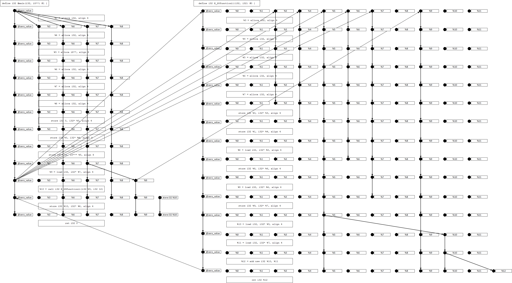

Phasar a LLVM-based Static Analysis Framework
=============================================
Version 1.1

Secure Software Engineering Group
---------------------------------

+ Philipp Schubert (philipp.schubert@upb.de) and others
+ Please also refer to https://phasar.org/

|branch | status |
| :---: | :---: |
| master |  |
| development |  |

Currently supported version of LLVM
-----------------------------------
Phasar is currently set up to support LLVM-5.0.0/ LLVM-5.0.1.

What is Phasar?
---------------
Phasar is a LLVM-based static analysis framework written in C++. It allows users
to specify arbitrary data-flow problems which are then solved in a 
fully-automated manner on the specified LLVM IR target code. Computing points-to
information, call-graph(s), etc. is done by the framework, thus you can focus on
what matters.

How do I get started with Phasar?
---------------------------------
We have some documentation on Phasar in our wiki. You probably would like to read 
this README first and then have a look on the material provided on https://phasar.org/
as well. Please also have a look on Phasar's project directory and notice the project directory
examples/ as well as the custom tool tools/myphasartool.cpp.

Building Phasar
---------------
If you cannot work with one of the pre-built versions of Phasar and would like to
compile Phasar yourself, then please check the wiki for installing the 
prerequisites and compilation. It is recommended to compile Phasar yourself in
order to get the full C++ experience and to have full control over the build 
mode.

Please help us to improve Phasar
--------------------------------
You are using Phasar and would like to help us in the future? Then please 
support us by filling out this [web from](https://goo.gl/forms/YG6m3M7sxeUJmKyi1).

By giving us feedback you help to decide in what direction Phasar should stride in
the future and give us clues about our user base. Thank you very much!


Table of Contents
=================

* [Purpose of this tool](#purpose-of-this-tool)
* [Errors](#errors)
    * [Observations](#observations)
* [Installation](#installation)
    * [Visualization Installation](#visualization-installation)
    * [Brief example using an Ubuntu system](#brief-example-using-an-ubuntu-system)
        * [Installing SQLITE3](#installing-sqlite3)
        * [Installing MySQL](#installing-mysql)
        * [Installing BEAR](#installing-bear)
        * [Installing PYTHON3](#installing-python3)
        * [Installing BOOST](#installing-boost)
        * [Installing LLVM](#installing-llvm)
        * [Installing cURL](#installing-curl)
        * [Installing Node.js](#installing-node.js)
        * [Installing Yarn](#installing-yarn)
        * [Installing MongoDB](#installing-mongodb)
    * [Compile Phasar](#compile-phasar)
    * [Brief example using a MacOS system](#brief-example-using-a-MacOS-system)
    * [A remark on compile time](#a-remark-on-compile-time)
    * [Creating the configuration files](#creating-the-configuration-files)
    * [Testing single modules](#testing-single-modules)
    * [Testing whole projects](#testing-whole-projects)
* [Getting started](#getting-started)
    * [Choosing an existing analysis](#choosing-an-existing-analysis)
    * [Command line interface](#command-line-interface)
    * [Running an analysis](#running-an-analysis)
        * [A concrete example and how to interpret the results](#a-concrete-example-and-how-to-interpret-the-results)
    * [Running Phasar via web interface](#running-phasar-via-web-interface)
    * [Analyzing a complex project](#analyzing-a-complex-project)
    * [Writing a static analysis](#writing-a-static-analysis)
        * [Choosing a control-flow graph](#choosing-a-control-flow-graph)
        * [Useful shortcuts](#useful-shortcuts)
            * [The std::algorithm header](#the-stdalgorithm-header)
            * [The pre-defined flow_func classes](#the-pre-defined-flow_func-classes)
        * [Important template parameters](#important-template-parameters)
        * [Writing an intra-procedural monotone framework analysis](#writing-an-intra-procedural-monotone-framework-analysis)
        * [Writing an inter-procedural monotone framework analysis (using call-strings)](#writing-an-inter-procedural-monotone-framework-analysis-using-call-strings)
        * [Writing an IFDS analaysis](#writing-an-ifds-analaysis)
        * [Writing an IDE analysis](#writing-an-ide-analysis)


Purpose of this tool
--------------------
Phasar provides a static analysis framework that has been implemented on top of LLVM.
Phasar has been developed with the goal to make static analysis easier, more accessible.
Furthermore, it tries to establish a novel platform to evaluate new concepts and ideas
in the area of program analysis.

### Errors
This framework is still under development. Thus, it might contain errors that
are (un)known to the developers. If you find an error please create an issue [in our tracker on Github](../../issues). The report should include at least a summary of what you 
were doing when you hit the error and a complete error message (if possible). 
We will try to fix bugs as quickly as possible, please help us achieving this goal.
If you are familiar with program analysis and LLVM you are free to fix the bug,
improve Phasar, and send a pull request.

#### Observations
We experienced some segmentation faults caused by the OS's stack size limit when analyzing programs with more than
 ~ > 240 k IR instructions or ~ > 21 k call-sites.
The limits can be check with

`$ ulimit -a`

In case you would like to analyze larger programs adjust the stack size limit to your needs e.g. set the
limit to 16 MB:

`$ ulimit -s 16777216`


Installation
------------
The installation of Phasar is not trivial, since it has some library
dependencies. The libraries needed in order to be able to compile and run
Phasar successfully are the following.

In the following the authors assume that a Unix-like system is used.
Installation guides for the libraries can be found here:

[LLVM / Clang](http://apt.llvm.org/)

[BOOST](http://www.boost.org/doc/libs/1_66_0/more/getting_started/unix-variants.html)

[SQLITE3](https://www.sqlite.org/download.html)

[MySQL](https://www.mysql.com/)

[BEAR](https://github.com/rizsotto/Bear)

[PYTHON](https://www.python.org/)

[ZLIB](https://zlib.net/) - a lossless data-compresion library

[LIBCURSES](http://www.gnu.org/software/ncurses/ncurses.html) - a terminal control library for constructing text user interfaces.

[Doxygen](www.doxygen.org) 

[Graphviz](www.graphviz.org)

### Visualization Installation
To run Phasar from the web interface additional libraries are required and need to be installed **manually**.
Installation guides for the libraries can be found here:

[cURL](https://curl.haxx.se/download.html)

[Node.js](https://nodejs.org/en/download/package-manager/)

[Yarn](https://yarnpkg.com/en/docs/getting-started)

[MongoDB Community Edition](https://docs.mongodb.com/manual/administration/install-community/)

All remaining dependencies are managed by the Yarn dependency manager. Resolved dependencies are stored
in the `yarn.lock` file. To install the dependencies run

`$ yarn install` 

from within the vis/ directory.

### Brief example using an Ubuntu system
In the following we would like to give an complete example of how to install 
Phasar using an Ubuntu (16.04) or Unix-like system. It that case most dependencies
can be installed using the apt package management system.


#### Installing ZLIB
ZLIB can just be installed from the Ubuntu sources:

`$ sudo apt-get install zlib1g-dev`

That's it - done.


#### Installing LIBCURSES
LIBCURSES can just be installed from the Ubuntu sources:

`$ sudo apt-get install libncurses5-dev`

Done!


#### Installing SQLITE3
SQLITE3 can just be installed from the Ubuntu sources:

`$ sudo apt-get install sqlite3 libsqlite3-dev`

That's it - done.

#### Installing MySQL
MySQL can be installed from the Ubuntu sources using:

`$ sudo apt-get install libmysqlcppconn-dev`

#### Installing BEAR
BEAR can just be installed from the Ubuntu sources:

`$ sudo apt-get install bear`

Done!

#### Installing PYTHON3
Python3 can be installed using the Ubuntu sources as well. Just use
the command:

`$ sudo apt-get install python3`

and you are done.


#### Installing DOXYGEN and GRAPHVIZ (Required for generating the documentation)
If you want to generate the documentation running 'make doc' you have to install 
[Doxygen](www.doxygen.org) and [Graphviz](www.graphviz.org).
To install them just use the command:
  
  `$ sudo apt-get install doxygen graphviz`

Done!


#### Installing BOOST
First you have to download the BOOST source files. This can be achieved by:

`$ wget https://dl.bintray.com/boostorg/release/1.66.0/source/boost_1_66_0.tar.gz`

Next the archive file must be extracted by using:

`$ tar xvf boost_1_66_0.tar.gz`

Jump into the directory!

`$ cd boost_1_66_0/`

The next command which prepares the compilation process assumes that you have
write permission in your system's /usr/local/ directory.

`$ ./bootstrap.sh`

If no errors occur boost can now be installed using admin permission:

`$ sudo ./b2 install`

You should be able to find the boost installation on your system now.

`$ ls /usr/local/lib`

Should output a lot of library files prefixed with 'libboost_'.
The result of the command

`$ ls /usr/local/include`

should contain one directory which is called 'boost'. Congratulations, now you
have installed boost.

#### Installing LLVM
When installing LLVM your best bet is probably to install it by using the installer script
install-llvm-*.sh that can be found in Phasar project directory utils/. Parameterize it with the number of cores that
shall be used for compilation (more is better) and tell it where you would like LLVM to
be downloaded and build. E.g. use

`$ ./install-llvm-5.0.1.sh 4 ~/`

to build llvm-5.0.1 using 4 cores in your home directory.

#### Installing cURL
cURL can be installed from the Ubuntu sources using:

`$ sudo apt-get install curl`

Done!

#### Installing Node.js
To install Node.js 10 on Debian and Ubunut based Linux distributions, use the following commands:
```
$ curl -sL https://deb.nodesource.com/setup_10.x | sudo -E bash -
$ sudo apt-get install -y nodejs
```

Done!

#### Installing Yarn
Yarn can be installed using their Debian package repository. First, configure the repository:
```
$ curl -sS https://dl.yarnpkg.com/debian/pubkey.gpg | sudo apt-key add -
$ echo "deb https://dl.yarnpkg.com/debian/ stable main" | sudo tee /etc/apt/sources.list.d/yarn.list
```

Then you can simply:

`$ sudo apt-get update && sudo apt-get install yarn`

Done!

#### Installing MongoDB
To install MongoDB using .deb packages, you have to import the public key used by the package management system:

`$ sudo apt-key adv --keyserver hkp://keyserver.ubuntu.com:80 --recv 9DA31620334BD75D9DCB49F368818C72E52529D4`

Create a list file for MongoDB (on Ubuntu 16.04):

`$ echo "deb [ arch=amd64,arm64 ] https://repo.mongodb.org/apt/ubuntu xenial/mongodb-org/4.0 multiverse" | sudo tee /etc/apt/sources.list.d/mongodb-org-4.0.list`

Then you can simply:

`$ sudo apt-get update && sudo apt-get install mongodb-org`

Done!

### Compile Phasar
Navigate into the Phasar directory. The following commands will do the job and compile the Phasar framework:

```
$ mkdir build
$ cd build/
$ cmake -DCMAKE_BUILD_TYPE=Release ..
$ make -j $(nproc) # or use a different number of cores to compile it
```

After compilation using cmake the following two binaries can be found in the build/ directory:

+ phasar - the actual Phasar command-line tool
+ myphasartool - an example tool that shows how tools can be build on top of Phasar

Use the command:

`$ ./phasar --help`

in order to display the manual and help message.

`$ sudo make install`

Please be careful and check if errors occur during the compilation.

When using CMake to compile Phasar the following optional parameters can be used:

| Parameter : Type|  Effect |
|-----------|--------|
| <b>BUILD_SHARED_LIBS</b> : BOOL | Build shared libraries (default is OFF) |
| <b>CMAKE_BUILD_TYPE</b> : STRING | Build Phasar in 'Debug' or 'Release' mode <br> (default is 'Debug') |
| <b>CMAKE_INSTALL_PREFIX</b> : PATH | Path where Phasar will be installed if <br> “make install” is invoked or the “install” <br> target is built (default is /usr/local) |
| <b>PHASAR_BUILD_DOC</b> : BOOL | Build Phasar documentation (default is OFF) |
| <b>PHASAR_BUILD_UNITTESTS</b> : BOOL | Build Phasar unittests (default is OFF) |
| <b>PHASAR_ENABLE_PAMM</b> : STRING | Enable the performance measurement mechanism <br> ('Off', 'Core' or 'Full', default is Off) |
| <b>PHASAR_ENABLE_PIC</b> : BOOL | Build Position-Independed Code (default is ON) |
| <b>PHASAR_ENABLE_WARNINGS</b> : BOOL | Enable compiler warnings (default is ON) |


#### A remark on compile time
C++'s long compile times are always a pain. As shown in the above, when using cmake the compilation can easily be run in parallel, resulting in shorter compilation times. Make use of it!

### Brief example using a MacOS system
Mac OS 10.13.1 or higher only !
To install the framework on a Mac we will rely on Homebrew. (https://brew.sh/)

The needed packages are
```
$ brew install boost
$ brew install python3
```

**To be continued.**


##### Running a test solver
To test if everything works as expected please run the following command:

`$ phasar --module test/build_systems_tests/installation_tests/module.ll -D ifds-solvertest`

If you obtain output other than a segmentation fault or an exception terminating the program abnormally everything works as expected.


Getting started
---------------
In the following we will describe how Phasar can be used to perform data-flow analyses.

### Choosing an existing analysis
Phasar's built-in analyses can be selected using the -D or --analysis command-line option. 
Note: more than one analysis can be selected to be executed on the code under analsis. Example:

```
$ phasar -m module.ll -D ifds-solvertest
$ phasar -m module.ll -D ifds-uninit
```

If no analysis is selected only the call-graph and other support data structures are created. 
If a call using "-D none" fails, there is definitely an error within the code or project under 
analysis or within the framework (which is obviously worse). In any way please report these errors
and include your target code that triggers the error.

Currently the following built-in analyses are available in Phasar:

| DataFlowAnalysisType | Parameter |
|----------------------|-----------|
|DataFlowAnalysisType::IFDS_ConstAnalysis | "ifds-const"|
|DataFlowAnalysisType::IFDS_LinearConstantAnalysis | "ifds-lca"|
|DataFlowAnalysisType::IFDS_SolverTest | "ifds-solvertest"|
|DataFlowAnalysisType::IFDS_TaintAnalysis | "ifds-taint"|
|DataFlowAnalysisType::IFDS_TypeAnalysis | "ifds-type"|
|DataFlowAnalysisType::IFDS_UninitializedVariables | "ifds-uninit"|
|DataFlowAnalysisType::IDE_LinearConstantAnalysis | "ide-lca"|
|DataFlowAnalysisType::IDE_SolverTest | "ide-solvertest"|
|DataFlowAnalysisType::IDE_TaintAnalysis | "ide-taint"|
|DataFlowAnalysisType::IDE_TypeStateAnalysis | "ide-typestate"|
|DataFlowAnalysisType::Inter_Mono_SolverTest | "inter-mono-solvertest"|
|DataFlowAnalysisType::Inter_Mono_TaintAnalysis | "inter-mono-taint"|
|DataFlowAnalysisType::Intra_Mono_FullConstantPropagation | "intra-mono-fullconstpropagation"|
|DataFlowAnalysisType::Intra_Mono_SolverTest | "intra-mono-solvertest"|
|DataFlowAnalysisType::Plugin | "plugin"|
|DataFlowAnalysisType::None | "none"|


### Command line interface
Phasar provides a stable command line interface (CLI). The Phasar frameworks supports the parameter that are displayed
using -h | --help.
```
Command-line options:
  -h [ --help ]                        Print help message
  --more_help                          Print more help
  --config arg                         Path to the configuration file, options
                                       can be specified as 'parameter = option'
  --silent                             Suppress any non-result output

Configuration file options:
  -f [ --function ] arg                Function under analysis (a mangled
                                       function name)
  -m [ --module ] arg                  Path to the module(s) under analysis
  -p [ --project ] arg                 Path to the project under analysis
  -E [ --entry-points ] arg            Set the entry point(s) to be used
  -O [ --output ] arg (=results.json)  Filename for the results
  -D [ --data-flow-analysis ] arg      Set the analysis to be run
  -P [ --pointer-analysis ] arg        Set the points-to analysis to be used
                                       (CFLSteens, CFLAnders)
  -C [ --callgraph-analysis ] arg      Set the call-graph algorithm to be used
                                       (CHA, RTA, DTA, VTA, OTF)
  -H [ --classhierachy-analysis ] arg  Class-hierarchy analysis
  -V [ --vtable-analysis ] arg         Virtual function table analysis
  -S [ --statistical-analysis ] arg    Statistics
  -W [ --wpa ] arg (=1)                Whole-program analysis mode (1 or 0)
  -M [ --mem2reg ] arg (=1)            Promote memory to register pass (1 or 0)
  -R [ --printedgerec ] arg (=0)       Print exploded-super-graph edge recorder
                                       (1 or 0)
  --analysis-plugin arg                Analysis plugin(s) (absolute path to the
                                       shared object file(s))
  --callgraph-plugin arg               ICFG plugin (absolute path to the shared
                                       object file)
  --project-id arg (=myphasarproject)  Project Id used for the database
  --graph-id arg (=123456)             Graph Id used by the visualization
                                       framework
  --pamm-out arg (=PAMM_data.json)     Filename for PAMM's gathered data
```

### Running an analysis
When you have chosen an analysis, you can run it on some code. The code on which the analysis runs is LLVM IR code.

Let us start with an easy example of analyzing some code. First let us consider some C/C++ code that a user would like to analyze. Let us assume there is a file called main.cpp with the following contents:
```C++
int main() {
    int i = 1;
    int j = 2;
    int k = i + j;
    return 0;
}
```
Since all analysis solvers are working on the LLVM IR we probably want to see the corresponding LLVM IR. (By the way: the LLVM Language Reference Manual can be found [here](http://llvm.org/docs/LangRef.html)). It makes much sense to make oneself familiar with the intermediate representation that all infrastructure is based on!

The above C/C++ code can be translated into the LLVM IR using programs of the LLVM compiler tool chain. In our case we call the clang compiler and ask it to emit the LLVM IR code.

`$ clang++ -emit-llvm -S main.cpp`

After running this command a file named main.ll can be found within the current directory. The main.ll should contain code similar to:
```C++
; ModuleID = 'main.cpp'
source_filename = "main.cpp"
target datalayout = "e-m:e-i64:64-f80:128-n8:16:32:64-S128"
target triple = "x86_64-unknown-linux-gnu"

; Function Attrs: noinline norecurse nounwind optnone uwtable
define i32 @main() #0 {
  %1 = alloca i32, align 4
  %2 = alloca i32, align 4
  %3 = alloca i32, align 4
  %4 = alloca i32, align 4
  store i32 0, i32* %1, align 4
  store i32 1, i32* %2, align 4
  store i32 2, i32* %3, align 4
  %5 = load i32, i32* %2, align 4
  %6 = load i32, i32* %3, align 4
  %7 = add nsw i32 %5, %6
  store i32 %7, i32* %4, align 4
  ret i32 0
}

attributes #0 = { noinline norecurse nounwind optnone uwtable "correctly-rounded-divide-sqrt-fp-math"="false" "disable-tail-calls"="false" "less-precise-fpmad"="false" "no-frame-pointer-elim"="true" "no-frame-pointer-elim-non-leaf" "no-infs-fp-math"="false" "no-jump-tables"="false" "no-nans-fp-math"="false" "no-signed-zeros-fp-math"="false" "no-trapping-math"="false" "stack-protector-buffer-size"="8" "target-cpu"="x86-64" "target-features"="+fxsr,+mmx,+sse,+sse2,+x87" "unsafe-fp-math"="false" "use-soft-float"="false" }

!llvm.module.flags = !{!0}
!llvm.ident = !{!1}

!0 = !{i32 1, !"wchar_size", i32 4}
!1 = !{!"clang version 5.0.1 (tags/RELEASE_501/final 332326)"}
```

It is important to recognize that all of our analysis run on the IR rather than the originally source code. The file to be analyzed by our framework can be specified using the -m flag. As default behavior Phasar starts the analysis at the very first instruction of the main() function.

An example call would be:

`$ phasar -m path/to/your/main.ll -D ifds-solvertest`

to run an IFDS solver test on the IR code contained in main.ll.

The LLVM infrastructure supports many different passes that can be run on the intermediate representation in order to optimize or simplify it. "The compiler front-end typically generates very stupid code" that becomes high quality code when applying various compiler passes to it. One very important pass that might be used is the so called memory to register pass (mem2reg). LLVM follows a register based design (unlike stack-based Java byte code). Conceptually LLVM assumes that it has an infinite amount of registers that it can use. (It is up to the code generator, to produce code that uses the amount of registers available for the target platform.) As you can see in our code example above we use some stack variables i, j, ... and so on. They translate into the LLVM IR as the result of alloca instructions which allocate the desired amount of stack memory. The mem2reg pass now tries to make use of the infinite amount of register in a way that it tries to eliminate as much 'memory cells' as possible and places values into registers instead. Due to complex pointer arithmetic LLVM is most of the time not able to eliminate all alloca instructions. Reducing the amount of memory cells makes analysis-writing much more easy. But it is important that one understand the conceptual step that mem2reg performs. Phasar runs the mem2reg pass automatically as default behavior on the code under analysis. For beginners and debug reasons this behavior of Phasar can be changed to not running mem2reg by using the --mem2reg option.

TODO!!!
Let us have a look what the mem2reg pass does to our IR code from above. We run the pass by using the opt tool provided by the compiler tool chain.

`$ opt -mem2reg -S main.ll`

The output of that command should look similar to

```C++
; ModuleID = 'simple.ll'
source_filename = "simple.cpp"
target datalayout = "e-m:e-i64:64-f80:128-n8:16:32:64-S128"
target triple = "x86_64-pc-linux-gnu"

; Function Attrs: norecurse nounwind uwtable
define i32 @main() #0 {
  %1 = add nsw i32 undef, 4
  %2 = add nsw i32 %1, 5
  ret i32 0
}

attributes #0 = { norecurse nounwind uwtable "disable-tail-calls"="false" "less-precise-fpmad"="false" "no-frame-pointer-elim"="true" "no-frame-pointer-elim-non-leaf" "no-infs-fp-math"="false" "no-jump-tables"="false" "no-nans-fp-math"="false" "no-signed-zeros-fp-math"="false" "stack-protector-buffer-size"="8" "target-cpu"="x86-64" "target-features"="+fxsr,+mmx,+sse,+sse2,+x87" "unsafe-fp-math"="false" "use-soft-float"="false" }

!llvm.ident = !{!0}

!0 = !{!"clang version 3.9.1-4ubuntu3~16.04.1 (tags/RELEASE_391/rc2)"}
```

As expected LLVM is able to place all values into registers and can completely replace all of the alloca instructions. Phasar does not care if you provide LLVM IR or optimized IR code when using it with the -m command-line option. But of course it makes sense to compile your source code into LLVM IR using the production flags in order to ensure that Phasar analyzes the code "as your machine sees it".


#### A concrete example and how to interpret the results
Let us consider this slightly more complex C++ program (one that involves a function call).
```C++
int function(int x) {
	return x + 1;
}

int main() {
	int i = 42;
	int j = function(i);
	return 0;
}
```

The above program translates into the following IR code:

```C++
; ModuleID = 'main.cpp'
source_filename = "main.cpp"
target datalayout = "e-m:e-i64:64-f80:128-n8:16:32:64-S128"
target triple = "x86_64-unknown-linux-gnu"

; Function Attrs: noinline nounwind optnone uwtable
define i32 @_Z8functioni(i32) #0 {
  %2 = alloca i32, align 4
  store i32 %0, i32* %2, align 4
  %3 = load i32, i32* %2, align 4
  %4 = add nsw i32 %3, 1
  ret i32 %4
}

; Function Attrs: noinline norecurse nounwind optnone uwtable
define i32 @main() #1 {
  %1 = alloca i32, align 4
  %2 = alloca i32, align 4
  %3 = alloca i32, align 4
  store i32 0, i32* %1, align 4
  store i32 42, i32* %2, align 4
  %4 = load i32, i32* %2, align 4
  %5 = call i32 @_Z8functioni(i32 %4)
  store i32 %5, i32* %3, align 4
  ret i32 0
}

attributes #0 = { noinline nounwind optnone uwtable "correctly-rounded-divide-sqrt-fp-math"="false" "disable-tail-calls"="false" "less-precise-fpmad"="false" "no-frame-pointer-elim"="true" "no-frame-pointer-elim-non-leaf" "no-infs-fp-math"="false" "no-jump-tables"="false" "no-nans-fp-math"="false" "no-signed-zeros-fp-math"="false" "no-trapping-math"="false" "stack-protector-buffer-size"="8" "target-cpu"="x86-64" "target-features"="+fxsr,+mmx,+sse,+sse2,+x87" "unsafe-fp-math"="false" "use-soft-float"="false" }
attributes #1 = { noinline norecurse nounwind optnone uwtable "correctly-rounded-divide-sqrt-fp-math"="false" "disable-tail-calls"="false" "less-precise-fpmad"="false" "no-frame-pointer-elim"="true" "no-frame-pointer-elim-non-leaf" "no-infs-fp-math"="false" "no-jump-tables"="false" "no-nans-fp-math"="false" "no-signed-zeros-fp-math"="false" "no-trapping-math"="false" "stack-protector-buffer-size"="8" "target-cpu"="x86-64" "target-features"="+fxsr,+mmx,+sse,+sse2,+x87" "unsafe-fp-math"="false" "use-soft-float"="false" }

!llvm.module.flags = !{!0}
!llvm.ident = !{!1}

!0 = !{i32 1, !"wchar_size", i32 4}
!1 = !{!"clang version 5.0.1 (tags/RELEASE_501/final 332326)"}
```

Running the [IFDS-SolverTest](#ifds-solvertest) analysis on the non-mem2reg transformed code produces the following IFDS/IDE results (which are quite different from the intra/inter monotone framework results that are completely self-explaining. For that reason, we omit their explanation here.):

```C++
### DUMP LLVMIFDSSolver results
--- IFDS START RESULT RECORD ---
N: store i32 %0, i32* %2, align 4, !phasar.instruction.id !3, ID: 1 in function: _Z8functioni
D:	@zero_value = constant i2 0, align 4, ID: -1 	V:  BOTTOM
--- IFDS START RESULT RECORD ---
N: %2 = alloca i32, align 4, !phasar.instruction.id !2, ID: 0 in function: _Z8functioni
D:	@zero_value = constant i2 0, align 4, ID: -1 	V:  BOTTOM
--- IFDS START RESULT RECORD ---
N: %3 = load i32, i32* %2, align 4, !phasar.instruction.id !4, ID: 2 in function: _Z8functioni
D:	@zero_value = constant i2 0, align 4, ID: -1 	V:  BOTTOM
--- IFDS START RESULT RECORD ---
N: ret i32 %4, !phasar.instruction.id !6, ID: 4 in function: _Z8functioni
D:	@zero_value = constant i2 0, align 4, ID: -1 	V:  BOTTOM
--- IFDS START RESULT RECORD ---
N: %3 = alloca i32, align 4, !phasar.instruction.id !4, ID: 7 in function: main
D:	@zero_value = constant i2 0, align 4, ID: -1 	V:  BOTTOM
--- IFDS START RESULT RECORD ---
N: store i32 0, i32* %1, align 4, !phasar.instruction.id !5, ID: 8 in function: main
D:	@zero_value = constant i2 0, align 4, ID: -1 	V:  BOTTOM
--- IFDS START RESULT RECORD ---
N: store i32 42, i32* %2, align 4, !phasar.instruction.id !6, ID: 9 in function: main
D:	@zero_value = constant i2 0, align 4, ID: -1 	V:  BOTTOM
--- IFDS START RESULT RECORD ---
N: %4 = load i32, i32* %2, align 4, !phasar.instruction.id !7, ID: 10 in function: main
D:	@zero_value = constant i2 0, align 4, ID: -1 	V:  BOTTOM
--- IFDS START RESULT RECORD ---
N: %5 = call i32 @_Z8functioni(i32 %4), !phasar.instruction.id !8, ID: 11 in function: main
D:	@zero_value = constant i2 0, align 4, ID: -1 	V:  BOTTOM
--- IFDS START RESULT RECORD ---
N: store i32 %5, i32* %3, align 4, !phasar.instruction.id !9, ID: 12 in function: main
D:	@zero_value = constant i2 0, align 4, ID: -1 	V:  BOTTOM
--- IFDS START RESULT RECORD ---
N: ret i32 0, !phasar.instruction.id !10, ID: 13 in function: main
D:	@zero_value = constant i2 0, align 4, ID: -1 	V:  BOTTOM
--- IFDS START RESULT RECORD ---
N: %4 = add nsw i32 %3, 1, !phasar.instruction.id !5, ID: 3 in function: _Z8functioni
D:	@zero_value = constant i2 0, align 4, ID: -1 	V:  BOTTOM
--- IFDS START RESULT RECORD ---
N: %1 = alloca i32, align 4, !phasar.instruction.id !2, ID: 5 in function: main
D:	@zero_value = constant i2 0, align 4, ID: -1 	V:  BOTTOM
--- IFDS START RESULT RECORD ---
N: %2 = alloca i32, align 4, !phasar.instruction.id !3, ID: 6 in function: main
D:	@zero_value = constant i2 0, align 4, ID: -1 	V:  BOTTOM
```

In IFDS/IDE results for each program statement N, all data-flow facts D holding at this program point are shown. Additionally the value from the value domain V is printed. Note: when running IFDS analysis, only BOTTOM is shown, since TOP is representing data-flow facts that do not hold and thus are irrelevant to the analysis user.

Additionally to the results, Phasar is able to record all edges from the exploded super-graph that the computation is based on. The edges reside in two edge recorders (for intra- and inter-procedural edges) inside the IDESolver implementation.

Here is a visualization of an exploded super-graph of a different analysis to give you an impression of what it looks like.




### Running Phasar via web interface

Before starting the web server, Phasar has to be compiled (see [Compile Phasar](#compile-phasar)) and the mongoDB database has to be started on the default port 27017. To start
an instance of mongoDB, run 

`$ mongod -dbpath=path/to/db/location`

You can use the vis/database/ directory as the data location for the database.

The 'package.json' contains a list of execution commands to start the web server. The most relevant are

`$ yarn start` and `$ yarn start-prod`.

The first command starts the server in debug mode, which provides additional log output and source mapping.
The second command starts the web server in production mode. This disables all logs and uses the minified and
uglified version of the source code to enhance performance.

Finally, visit [http://localhost:3000](http://localhost:3000) to use Phasar via the web interface. 


### Analyzing a complex project
When a more complex C/C++ project shall be analyzed, the help of a 'compile_commands.json' file is required. As mentioned earlier this database can be created with many of the common C/C++ build tools.

With help of the compilation database one can tell which C/C++ source files belong to the project and with what parameters they have to be compiled. This includes macro definitions, compiler flags as well as include paths. While these information are essential in oder to analyze a project, other important information is missing. The compilation database does not contain any information about how to link the compiled source files. In this section it is described how to prepare a C/C++ project such that the framework is able to analyze it.

There are three cases which are worth mentioning:

**(i) single self-contained program**

This is probably the easiest case. Here the project under analysis just consists of a bunch of C/C++ source files that can be - when compiled accordingly - directly linked into an executable file. No external libraries are used. You can use the external python script that will compile all files registed in the 'compile_commands.json' file with the correct parameterization using the external clang(++) front-end. The script only needs one parameter specifying the project directory containing the 'compile_commands.json' file. The script creates a new directory containing the LLVM IR compiled sources. Using the command line and changing into this directory you should be able to compile all of the *.ll files into the executable using:

`$ clang++ *.ll -o main`

If no errors occur, these are all the source files in LLVM IR needed in order to produce the final program. When you would like to perform a simple whole program analysis, you can link all LLVM IR code from the .ll files into a single IR file using the following command:

`$ llvm-link -S *.ll -o main.ll`

This file can now be feed into the framework using the '-m' switch. But you can also feed the .ll files into Phasar like: `$ phasar -m file1.ll file2.ll ...`


**(ii) single self-contained program using at least one library**

The next case that might occur is not much more complicated than (i). Here your C/C++ project also encodes a single executable program, but this time you get the following linker error when trying to link all *.ll files into the executable program:

[...] undefined reference: [...]

This error tells you that the linker cannot find some symbols (functions or variables) that the program is using. Be aware of that and use the compilers error message to get the names of the symbols that are not defined at this point. Since the framework does not care about having an executable we continue as follows: Link all IR that you have into one sinlge .ll file containing your complete program (except for the missing symbols), when performing a whole program analysis. In case of module-wise analysis just call the framework and specify all *.ll files.
Since the linker just told you, that some symbols are missing, you have to provide the framework with some summaries for the missing symbols if you want the project under analysis to be analyzed correctly. These summaries must describe the effects of the missing functions. For that purpose please refer to the material provided on https://phasar.org/.

**(iii) multi-program project**

This case is hard. Here your project encodes more than one program and may use external libraries. This case can be detected again by compiling all files in the 'compile_commands.json' into llvm IR using the external compilation script. Trying to link all .ll files into an executable file leads to violations of the one definition rule (ODR) and may result in unresolved reference errors. How to handle this case? Now your UNIX shell skills are required. The basic idea is to look for definitions of main() within the llvm IR files.

`$ grep -R "define i32 @main("`

The resulting list of files shows how many seperate programs your project actually contains. The idea now is to get rid of all but one file containing main in order to find what code belongs to that program. Now you try to relink the llvm IR code into an executable. If a again multiple definitions of the same symbol are found you have to use the UNIX commands in order to find what files to remove. Proceed until ODR is no more violated and only unresolved reference errors are shown by the linker. Make sure that these unresolved reference error really result from the use of external libraries and not from yourself having blindly removed too many .ll files. At this stage you can proceed as described in (ii), that is link all of your remaining .ll files into a single .ll file containig just the code for the program you have isolated. The remaining .ll code can now be analyzed using Phasar. Provide summaries for the library functions if you want to have your code analyzed correctly. Of course you have to repeat the very same procedure with the other files defining a main() function that you previoursly got rid off.

Addmittedly this procedure seems to be quite labor intensive and it sure is. But this is only tricky when analyzing foreign and previously unknown projects. However, when analyzing your own projects you most definitly know what is going on in your project; therfore you do not have to use your forensic skills to revers engineer what is actually happening.


### Writing a static analysis
Phasar provides several sophisticated mechanisms that allow you to
write your own data-flow analysis. In general, Phasar is designed in such a way that the analysis writer has to choose from several possible interfaces which he can use for a concrete static analysis. Depending on your analysis problem some interfaces are more suited than others. When having found the right interface for your problem, the analysis writer usually just has to provide a new class which implements the interfaces missing functionality which then in turn is the problem description for the analysis. This concrete problem description is then handed over to a corresponding solver, which solves the problem in a completely automatic fashion. In the following the possible data-flow solvers are ordered according to their power (and difficulty to provide an analysis for).

#### Choosing a control-flow graph
In general, all data-flow analysis is performed on the codes control-flow graph. When writing an analysis a user has to choose a control flow graph for his analysis to work. For that reason all of our solvers work either on the CFG.h (intra-procedural control-flow graph) or on the ICFG.h (inter-procedural control-flow graph) interface.

For instance, when writing a simple intra-procedural data-flow analysis using the monotone framework the use must use one of CFG.h's concrete implementation or provide his own implementation for this interface. Usually the pre-implemented LLVMBasedCFG.h should do the job and can be used out-of-the-box.

The inter-procedural call-string approach and the IFDS/ IDE frameworks solve a concrete analysis based on an inter-procedural control-flow graph describing the structure of the code under analysis. Depending on the analysis needs, you can use a forward-, backward-, or bi-directional inter-procedural control-flow graph.
However, most of the time the 'LLVMBasedICFG' should work just fine.

If necessary it is also possible to provide you own implementation of an ICFG. In that case just provide another class for which you provide a reasonable name. You implementation must at least implement the interface that is defined by the ICFG.h interface.

#### Useful shortcuts
In the following section some useful coding shortcuts are presented which may come very handy when writing a new analysis within Phasar.

##### The std::algorithm header
When overriding the classes in order to describe the problems within the monotone framework, oftentimes set operations like set union, set intersect or set difference are required. Writing these functions yourself is tedious. Therefore it makes much sense to use the existing set operation functions which are defined in the std::algorithm header file. Many useful functionality is provided there such as:
```C++
    ...
    std::includes /* subset */
    std::set_difference
    std::set_intersection
    std::set_union
    ...
```
The neat thing about these functions is that they are completely generic as they operating an iterators and provide several useful overloads. They work on different container types which follow the concept required by these functions.
In the following a small code example is presented:
```C++
    std::set<int> a = {1, 2, 3};
    std::set<int> b = {6, 4, 3, 2, 8, 1};
    std::set<int> c;
    std::set_union(a.begin(), a.end(),
                   b.begin(), b.end(),
                   inserter(c, c.begin()));
    bool isSubSet = std::includes(b.begin(), b.end(), a.begin(), a.end());
```

##### The pre-defined flow function classes
When defining flow functions in IFDS or IDE, sometimes a certain flow function type occurs more than once. For instance, the Kill flow function that kills a specific data-flow fact is often needed many times. As the writer of an IFDS or IDE analysis you can find several useful pre-defined flow functions that can be used directly. Another very useful example is the Identity flow function. Some of these flow functions are also defined as a singleton if possible in order to keep the amount of overhead as small as possible. You can use the pre-defined flow functions inside your flow function factories using std::make_shared().
We also provide some LLVM specific flow functions and some general edge functions that may be used when implementing an IDE analysis.

Here is a small code example:
```C++
    // in this example let domain D be const llvm::Value*

    shared_ptr<FlowFunction<const llvm::Value*>> getNormalFlowFunction(....) {
        // check the type of the instruction
        if( ...) {
            // do some work
        } else if (...) {
            // kill some data-flow fact
            return make_shared<Kill<const llvm::Value*>>(/* some fact to be killed */);
        } else {
            // just treat everything else as Identity
            return Identity<const llvm::Value*>::getInstance();
        }
    }
```


#### Important template parameters

The code is written in a very generic way. For that reason we use a lot of template parameters. Here we describe the most important template parameters:

* D
    - The type of the data-flow facts of your data-flow domain D. Very often you probably would like to use const llvm::Value *.
* N
    - The type of nodes in you inter-procedural control-flow graph (or statements/ instructions). When using analysis on llvm IR it will always be const llvm::Instruction *.
* M
    - The type of functions/ methods used by the framework. When using llvm it will be const llvm::Function *.
* I
    - The type of the inter-procedural control-flow graph to be used. Usually it will be some reference to a type implementing the ICFG.hh interface. For example: LLVMBasedICFG &.
* V/L
    - The is the type for the second - value domain - of IDE problem. What this should be really depends of your concrete analysis. When using IFDS you do not have to worry about this type, since it is automatically chosen for you as:

```C++
    enum class BinaryDomain {
        BOTTOM = 0,
        TOP = 1
    };
```

#### Writing an intra-procedural monotone framework analysis
This is probably the easiest analysis you can write and if the analysis writer is a beginner, he should definitely start at this point. Using an intra-procedural monotone framework analysis, an data-flow analysis problem can be solved within one single function (caution: function calls within the function under analysis are not followed, but the call-sites are still in the code of course). In order to formulate such an analysis the user has to implement the InraMonoProblem.h interface. His implemented analysis is then handed over to the corresponding IntraMonotonSolver.h which solves his analysis problem.


#### Writing an inter-procedural monotone framework analysis (using call-strings)
The implementation will be finished soon.

This analysis can be used when inter-procedural data-flow problems must be solved. It uses the classical monotone framework combined with the call-string approach to achieve k-context sensitivity. The k can be specified by the analysis implementor. The interface the analysis writer has to implement (InterMonoProblem) contains a few more functions than the IntraMonotoneProblem.hh and thus is slightly more complex. Please note that this solver has scaling problems for a large k on large programs. If the analysis writer demands a scalable analysis with infinite context sensitivity, he may would like to formulate his data-flow problem with an IFDS or IDE analysis (caution: IFDS and IDE can only be used when the flow functions used are distributive).


#### Writing an IFDS analaysis
When you would like to write your own data-flow analysis using IFDS you basically just have
to implement a single class. Is is a good idea to create a new directory for your new analysis
that lives below 'ifds_ide_problems' and is name after the naming conventions that you will find
there and contains the name of the analysis in one form or another.

To make your class an analysis problem our solver is able to solve, you let your class inherit from
'DefaultIFDSTabulationProblem'. The concrete analysis is formulated by overwriting all
abstract functions of the 'DefaultIFDSTabulationProblem'. The member functions you have to override are:

* getNormalFlowFunction()
    - Here you formulate you flow function(s) that is (are) applied to every instruction within
      a functions body.

* getCallFlowFunction()
    - Here you express what the solver should do when it hits a call-site. In this flow function
      the actual parameters are usually mapped to the formal parameters of the called function.

* getRetFlowFunction()
    - Here you usually propagate the information at the end of the callee back to the caller.

* getCallToRetFlowFunction()
    - Every information that is not touched by the function called is handled here. Usually
      you just want to pass every information as identity.

* Optional: getSummaryFlowFunction()
    - Default: Implement to return nullptr. But can be used to model llvm.intrinsic functions or libc function
      that you do not want to follow as no implementation is available.

* initialSeeds()
    - The initial seeds are the starting points of your analysis. An analysis can start at one
      or more points in your program. The functions must return start points as well as a set
      of data-flow facts that hold at these program points. Unless your analysis requires otherwise
      you would just give the first instruction of the main function as a starting point and
      use the special zero fact that holds at the analysis start.

* createZeroValue()
    - This function must define what value your analysis should use as the special zero value.

* Constructor
    - The constructor of you analysis receives the ICFG that shall be used for this analysis
      as a parameter. Furthermore, the constructor of the DefaultIFDSTabulationProblem that you
      inherit from must be called AND the special zero value must be initialized in a suitable way.
      Here is an example of how your constructor can looks like:

```C++
  IFDSSolverTest::IFDSSolverTest(LLVMBasedICFG &I, vector<string> EntryPoints)
    : DefaultIFDSTabulationProblem<const llvm::Instruction *,
                                   const llvm::Value *, const llvm::Function *,
                                   LLVMBasedICFG &>(I), EntryPoints(EntryPoints) {
    DefaultIFDSTabulationProblem::zerovalue = createZeroValue();
  }
```

#### Writing an IDE analysis
If you read this, you made it very far and will now explore the most complex solver we currently provide within Phasar (but do not worry, we are already planing to include another even more abstract solver).
When writing an IDE analysis you only have to implement a single class as well.
The general concept is very similar to writing an IFDS analysis. But this time your analysis
class has to inherit from 'DefaultIDETabulationProblem'. In addition to this documentation, please also refer to the 
built-in implementations of IDE data-flow analysis of Phasar.

The member functions you have to provide some implementations for are:

* getNormalFlowFunction()
    - See Writing an IFDS analysis

* getCallFlowFuntion()
    - See writing an IFDS analysis

* getRetFlowFunction()
    - See writing an IFDS analysis

* getCallToRetFlowFunction()
    - See writing an IFDS analysis

* Optional: getSummaryFlowFunction()
    - see writing an IFDS analysis

* initialSeeds()
    - See writing an IFDS analysis

* topElement()
    - A function that returns the top element of the lattice the analysis is using -> meaning no information at all

* bottomElement()
    - A function that returns the bottom element of the lattice the analysis is using -> meaning all information (the most imprecise lattice elemnt)

* join()
    - A function that defines how information is joined (the merge operator of the lattice),
      which gets you higher up in the lattice (making the result less precise).

* allTopFunction()
    - Function that returns the a special edge function allTop that can be viewed as the function representation of the top value.

* getNormalEdgeFunction()
    - Here you formulate your edge function(s) that is (are) applied to every instruction within
	  a functions body.

* getCallEdgeFunction()
    - Here you express what the solver should do when it hits a call-site. In this edge function
      the actual parameters are usually mapped to the formal parameters of the called function.

* getReturnEdgeFunction()
    - Express the edge function that is applied to map data-flow facts that hold at the
      end of a callee back to the caller.

* getCallToReturnEdgeFunction()
    - Here the edge function is defined that is applied for data-flow facts that 'go around'
      the call-site.

* Constructor
    - See Constructor of Writing an IFDS analysis

Please also refer to the IDE analysis IDELinearConstantAnalysis.
